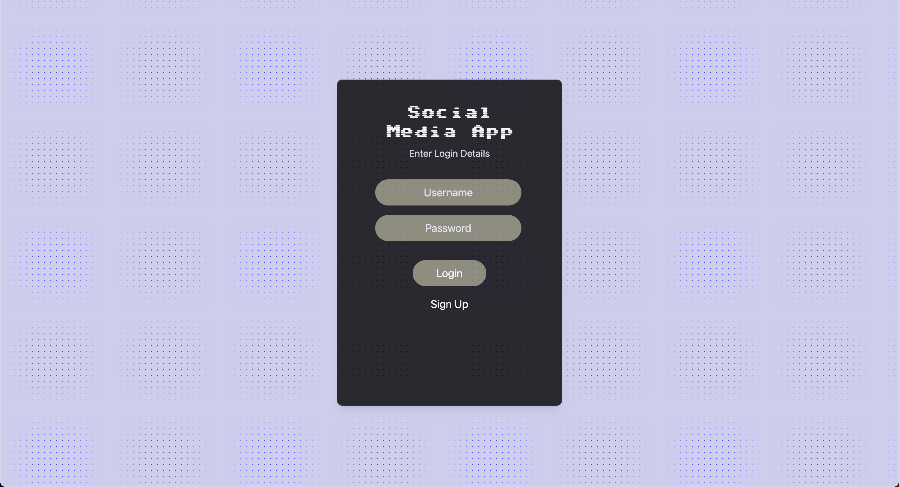

# MERN Stack Project with Local MongoDB



### Description

This project is a full-stack application built using the MERN (MongoDB, Express.js, React.js, Node.js) stack. It utilizes a local MongoDB database for storing data, and various technologies such as Yarn, Vite, React, Mongoose, Express, and Tailwind CSS.

### Features

- Allows users to perform CRUD (Create, Read, Update, Delete) operations on posts.
- Implements user authentication and authorization.
- Utilizes React for the frontend user interface.
- Stores data in a local MongoDB database.
- Uses Express.js as the backend server.
- Implements responsive design using Tailwind CSS.

### Prerequisites

- [MongoDB Shell](https://www.mongodb.com/docs/mongodb-shell/)
- Node v.20
- Yarn (or npm)

### Installation

To run this project locally, follow these steps:

1.  Start up a local MongoDB instance and using the Mongo shell initiate a new database `social-media-app`

    ```
    mongosh
    ```

    ```
    use social-media-app
    ```

2.  In a new terminal window clone the repository to your local machine:

    ```
    git clone <repository-url>
    ```

3.  Navigate to the project directory:

    ```
    cd <project-directory>
    ```

4.  Install dependencies in root, client and backend using Yarn:

    ```
    yarn
    ```

5.  Set up environment variables:

    - Create a `.env` file in both client and backend root directories.
    - Copy the contents from `.env.example` and replace the placeholder values with your own.

6.  Navigate to root of project and start the development server:

    ```
    yarn start
    ```

    Note: This will run backend and client concurrently.

7.  Access the application:

    - Once the server starts, you can access the application by visiting `http://localhost:5173/` in your web browser.

### Usage

- The application provides a user interface where all posts in database are displayed as a feed. The user can use CRUD methods to edit this feed.
- Users can register, login, and perform various actions based on their authentication status.

### Future Improvements

- Migrate from using local storage to a more secure way of authenticating (HTTP cookies/ OAuth etc.)
- Enforce high quality passwords.
- Add loader animation
- Build a Profile page where users can see only their posts.
- Update Feed so that users can only edit their own posts.
- Use react context for state management
- Optimize for A11y and performance

### Contributing

Contributions are welcome!
